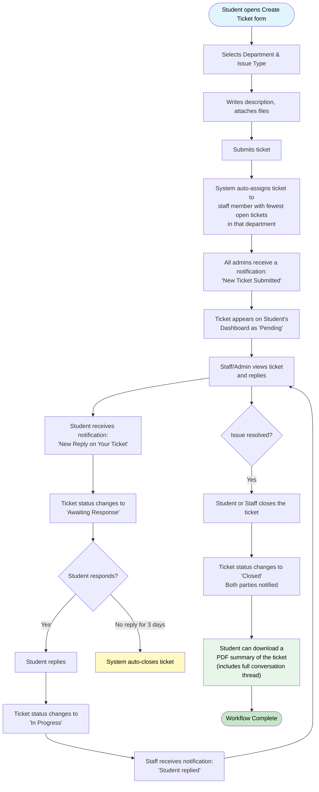
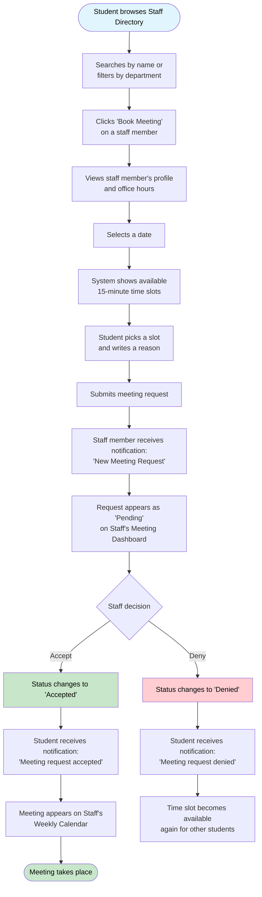
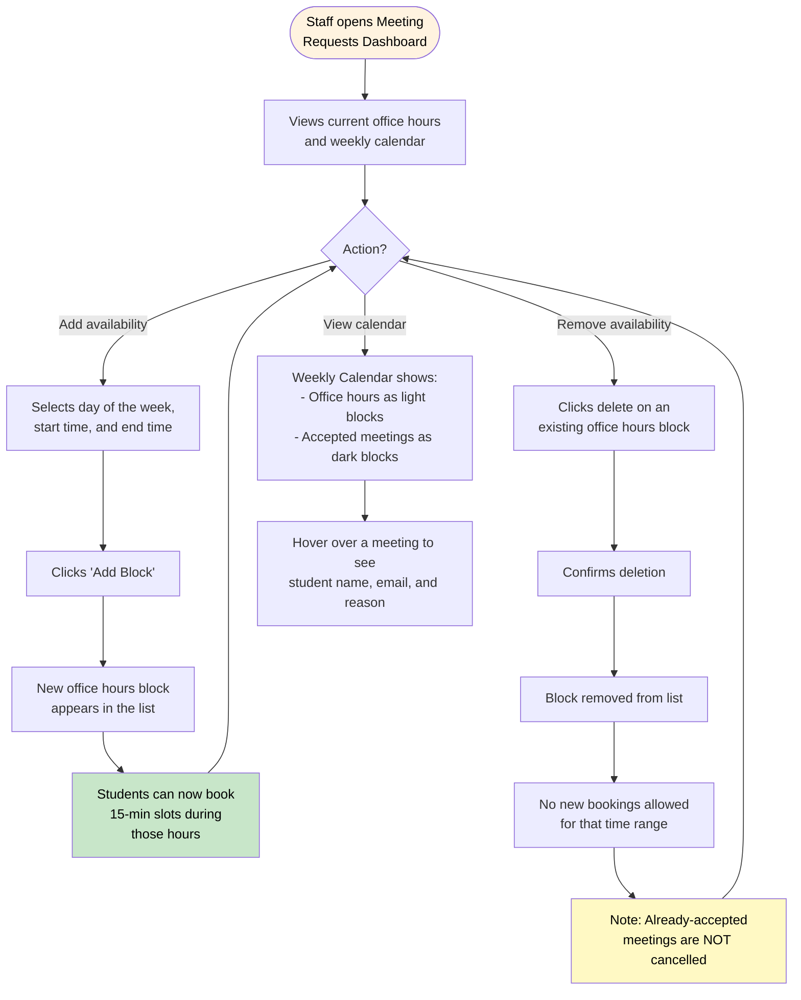
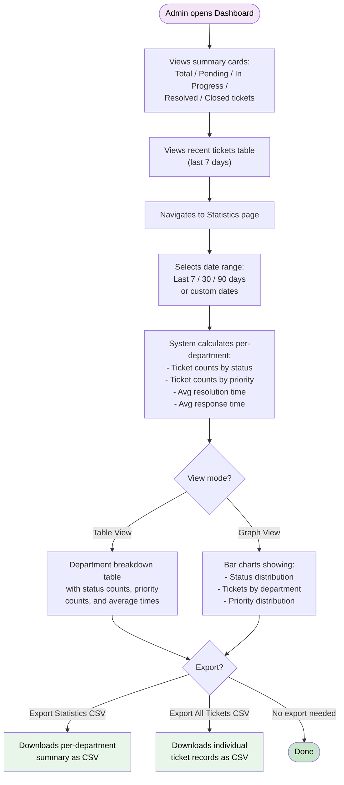

# PackItUp System Workflow Diagrams

---

## 1. Ticket Creation Workflow

### Diagram

### Description

> A **student** creates a ticket by selecting a department, issue type, writing a description (with optional file attachments and priority). Upon submission, the system **automatically assigns** the ticket to the least-busy staff member in that department, and **all admins are notified**. The assigned staff member reviews and replies, which **notifies the student** and sets the ticket to "Awaiting Response". The student and staff exchange replies in a back-and-forth conversation, with the ticket toggling between "In Progress" and "Awaiting Response". If the student does not reply within **3 days**, the system **auto-closes** the ticket. Once the issue is resolved, either party can **close the ticket**, and the student can then **download a PDF summary** containing the full ticket details and conversation history.

---

## 2. Meeting Request Workflow

### Diagram

### Description

> A **student** browses the Staff Directory (searchable by name, filterable by department), selects a staff member, and views their profile and office hours. After choosing a date, the system displays **available 15-minute time slots** (calculated from office hours minus already-booked meetings). The student selects a slot, provides a reason, and submits the request. The **staff member is notified** and sees the request as "Pending" on their Meeting Dashboard. The staff member can **accept** (the meeting appears on their Weekly Calendar and the student is notified) or **deny** (the student is notified and the time slot becomes available again for others).

---

## 3. Office Hours Management Workflow

### Diagram

### Description

> A **staff member** manages their availability from the Meeting Requests Dashboard. They can **add office hours** by selecting a day, start time, and end time — once saved, students can book 15-minute slots during those hours. They can **remove office hours** blocks (with a confirmation prompt), which prevents new bookings for that time range but does **not cancel** already-accepted meetings. The **Weekly Calendar** provides a visual overview: office hours appear as light blocks and accepted meetings as darker blocks, with hover tooltips showing student details.

---

## 4. Ticket Reporting Workflow

### Diagram

### Description

> An **admin** views the Dashboard which shows summary cards (total, pending, in-progress, resolved, closed ticket counts) and a recent tickets table. On the **Statistics page**, the admin selects a date range (quick presets or custom dates), and the system calculates **per-department analytics**: ticket counts by status and priority, average resolution time, and average response time to first staff reply. Results can be viewed as **tables** or **bar charts**. The admin can **export** the data as CSV — either a per-department summary or a full list of individual ticket records.

---

## Rendering Instructions

These diagrams use **Mermaid** syntax. To render them:
- **VS Code**: Install the "Markdown Preview Mermaid Support" extension
- **GitHub**: Mermaid diagrams render natively in `.md` files
- **Online**: Paste the mermaid code blocks at [mermaid.live](https://mermaid.live)
- **Export to PNG/SVG**: Use the Mermaid CLI (`mmdc`) or mermaid.live export feature
